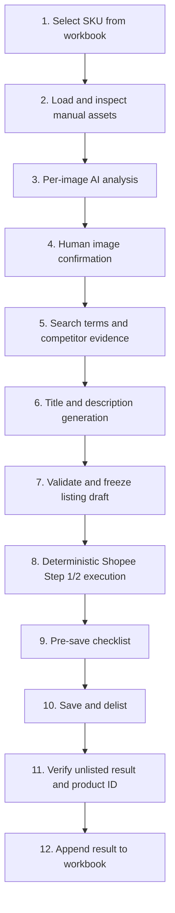

# Architecture

## Design goal

Produce high-quality Shopee listing material with AI where judgment is useful, then execute the approved result with ordinary program logic that is fast, testable, resumable, and auditable.

The project deliberately avoids making a general-purpose agent the live form-filling engine for every SKU.

## Pipeline

## Boundary 1: AI staging

AI stages may:

- read product images supplied by the operator;
- extract objective visible facts;
- rank/select images under explicit local rules;
- propose category search terms;
- analyze operator-provided competitor titles;
- create title and description candidates;
- return structured JSON for review.

Every image result is split into two objects:

- `objective_record` contains observable facts and uncertainty;
- `selection_assessment` contains local ranking/selection judgment.

Only approved objective facts flow into later title and description stages. This prevents an image-selection opinion from silently becoming a product claim.

## Boundary 2: approval packet

The handoff is a structured `listing_draft.json` packet. It freezes the fields that deterministic execution needs, including selected assets, title, description, variations, stock, packaging, store identity, and execution mode.

Benefits:

- a retry does not need to regenerate every AI result;
- operators can inspect the exact data that will be sent to the form runner;
- schema and business-rule checks happen before browser mutation;
- failures can be reproduced from a small artifact instead of a full conversation.

## Boundary 3: deterministic execution

The browser layer uses Chrome DevTools Protocol against an already authorized Ziniao Browser session. Form actions are implemented as narrow components for titles, rich text, image/video inputs, categories, dropdowns, variations, GTIN, packaging, logistics, modals, and save-state verification.

The executor does not ask an AI model to choose buttons or reinterpret the page at runtime. If expected state is absent, it records evidence and stops.

## Safety gates

The following are architectural invariants:

1. The automated terminal action is `save_delist`.
2. A failed required field, visible platform error, missing success state, or mismatched store binding stops the run.
3. Product ID lookup runs only after the save result is confirmed.
4. Workbook write-back runs only after product ID and store identity are bound to the successful result.
5. Secrets never belong in listing drafts, reports, screenshots, HTML snapshots, or logs.

## Evidence and recovery

The application can retain:

- candidate-selection results;
- asset manifests;
- per-image AI results and caches;
- approved listing drafts;
- pre-save checklist results;
- sanitized success/failure reports;
- screenshots and HTML snapshots for local diagnosis;
- final result tokens that bind store, SKU, and product ID.

Generated evidence directories are intentionally excluded from Git because they can contain business data.

## Module map

- `candidate_selector.py`, `workbook_reader.py` — source data and candidate selection.
- `config_manager.py` — persisted store names and their source status-column, description-template, and result-sheet mappings.
- `asset_inspector.py` — manual asset loading, extraction, and manifests.
- `ai_provider.py`, `ai_schema.py`, `prompt_config.py` — provider adapters, structured outputs, and prompt controls.
- `listing_builder.py` — description, variations, and listing packet construction.
- `ziniao_connector.py`, `browser/` — session discovery and CDP transport.
- `shopee/components/` — deterministic page components.
- `shopee/product_new_page.py`, `shopee/product_list_page.py` — execution and result verification.
- `listing_workbook_writer.py` — conflict-aware result write-back.
- `reporting/` — local diagnostic artifacts.
- `web_gui.py`, `linear_workflow_ui.py` — operator interface and workflow orchestration.

## Non-goals for 0.1.0

- Bypassing marketplace authentication, anti-abuse controls, or account permissions.
- Automatically publishing a live listing without an explicit future safety design.
- Generating product images. Current AI image capability analyzes and selects existing assets.
- Automatically downloading asset packs. The current release accepts a manually supplied local path only.
- Claiming compatibility with every Shopee region, browser container, or Seller Centre redesign.
